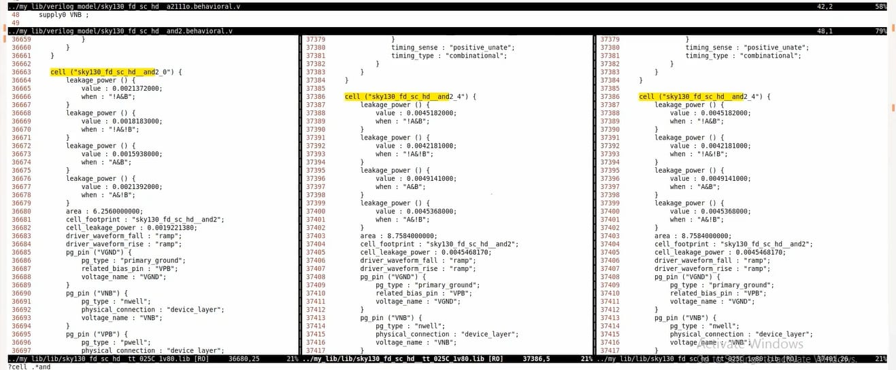
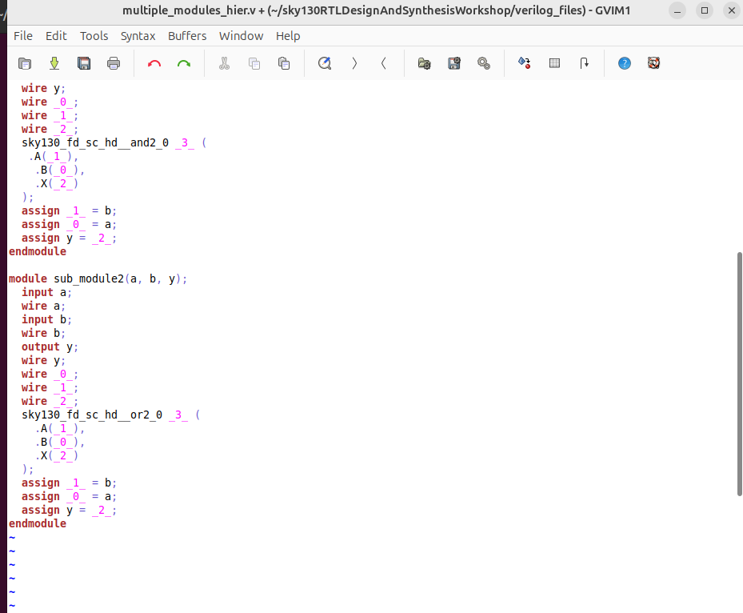
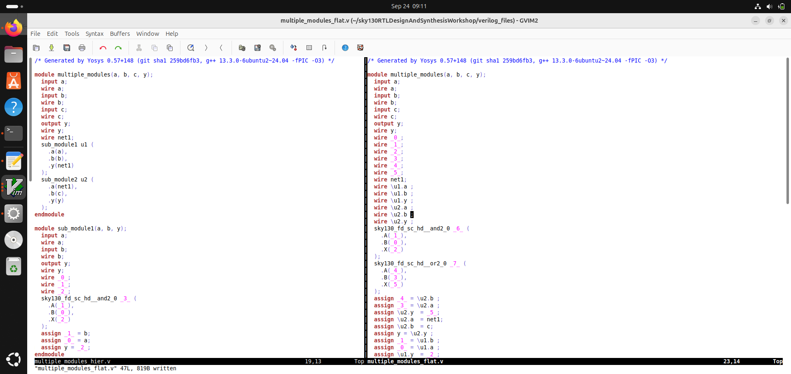
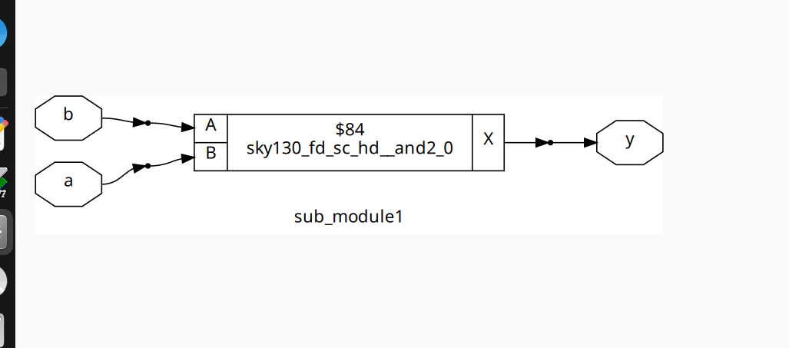
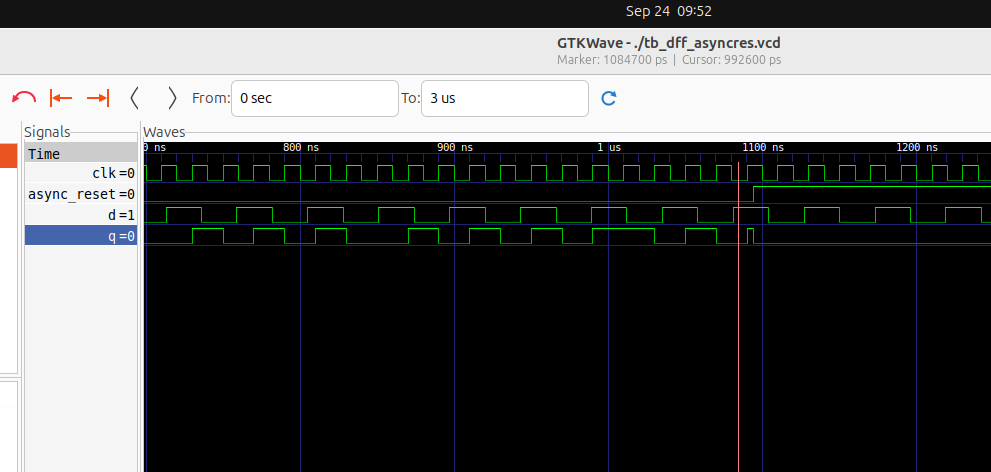
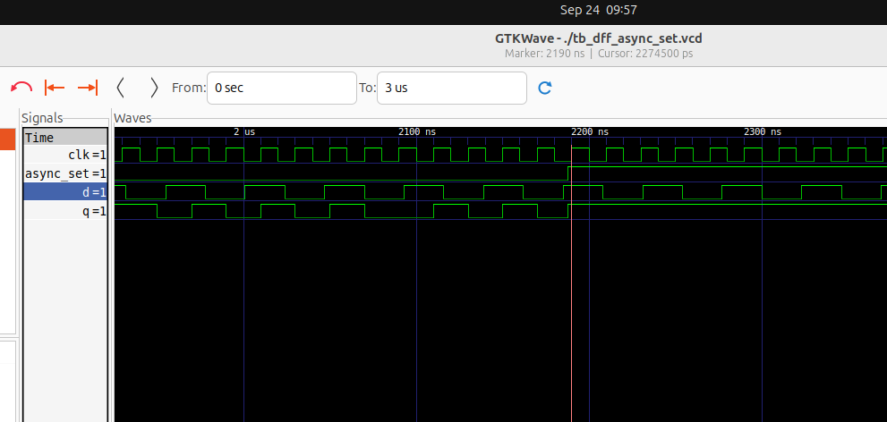
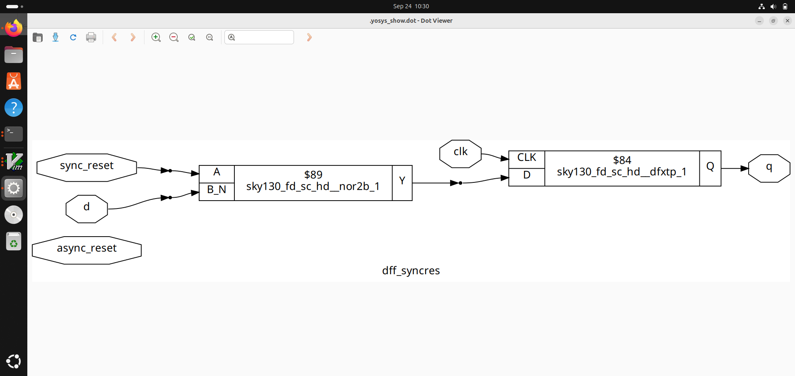
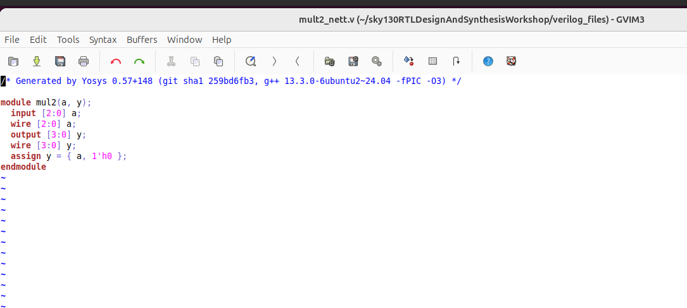
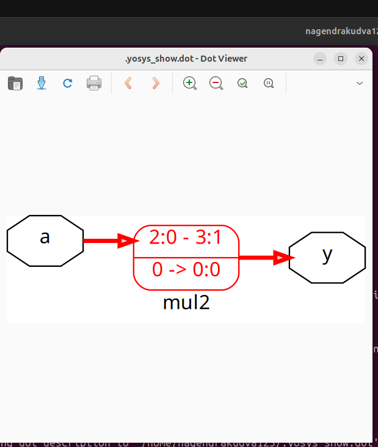
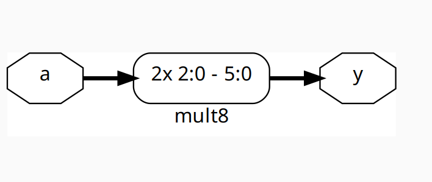

## 2. Day 2 - Timing Libs, Hierarchial Vs Flat Synthesis and Efficient Flop Coding Styles
### 2.1. Introduction to timing labs
```
__Command to open the libary file
$ gvim ../lib/sky130_fd_sc_hd__tt_025C_1v80.lib
__To shut off the background colors/ syntax off:
: syn off
__To enable the line numbers
: se nu
```

#### Contents

For a design to work, there are three important parameters that determines how the Silicon works: Process (Variations due to Fabrications), Voltage (Changes in the behavior of the circuit) and Temperature (Sensitivity of semiconductors). Libraries are characterized to model these variations. 


#### Various Flavours of AND Cell



### 2.2. Hierarchial synthesis vs Flat synthesis 

#### Hierarchial synthesis  
````
_Opening the file used for this experiment
$ gvim multiple_modules.v
_Invoke Yosys
$ yosys
_Read library 
$ read_liberty -lib ../lib/sky130_fd_sc_hd__tt_025C_1v80.lib
_Read Design
$ read_verilog multiple_modules.v
_Synthesize Design
$ synth -top multiple_modules
_Generate Netlist
$ abc -liberty ../lib/sky130_fd_sc_hd__t_025C_1v80.lib
_Realizing Graphical Version of Logic for multiple modules
$ show multiple_modules
_Writing the netlist in a crisp manner 
$ write_verilog -noattr multiple_modules_hier.v
$ !gvim multiple_modules_hier.v
````
**Multiple Modules:** - 2 SubModules
**Staistics of Multiple Modules**


**Netlist file**



#### Flat synthesis  

```
_To flatten the netlist
$ flatten
_Writing the netlist in a crisp manner and to view it
$ write_verilog -noattr multiple_modules_flat.v
$ !gvim multiple_modules_flat.v
```
**Realization of the Logic**


  
 
**Netlist file**



#### SUB MODULE LEVEL SYNTHESIS

Sub-module level synthesis is preferred when there are multiple instances of same module. Sythesizing the same module over several times may not be advantageous with respect to time. Instead, synthsis can be performed for one module, its netlist can be replicated and then stitched together in the top module. This is also used particulary in massive designs using divide and conquer method. 

**Statistics of Sub-module**


**NetList File of Sub-module**




### 2.3. Various Flop coding styles and optimization
In a digital design, when an input signal changes state, the output changes after a propogation delay. All logic gates add some delay to singals. These delays cause expected and unwanted transitions in the output, called as _Glitches_ where the output value is momentarily different from the expected value. An increased delay in one path can cause glitch when those signals are combined at the output gate. In short, more combinational circuits lead to more glitchy outputs that will not settle down with the output value. 

#### Flip flop overview
A D flip-flop is a sequential element that follows the input pin d at the clock's given edge. D flip-flop is a fundamental component in digital logic circuits.
There are two types of D Flip-Flops being implemented: Rising-Edge D Flip Flop and Falling-Edge D Flip Flop.


Every flop element needs an initial state, else the combinational circuit will evaluate to a garbage value. In order to achieve this, there are control pins in the flop namely: Set and Reset which can either be Synchronous or Asynchronous. 

#### _Asynchronous Reset/Set:_


>_ Here, always block gets evaluated when there is a change in the clock or change in the set/reset.The circuit is sensitive to positive edge of the clock. Upon the signal going low/high depending on reset or set control, singal q line goes changes respectively. Hence, it does not wait for the positive edge of the clock and happens irrespective of the clock_.

#### _Synchronous Reset:_


#### _Both Synchronous and Asynchronous Reset:_


#### FLIP FLOP SIMULATION

```
#Steps Followed for analysing Asynchronous behavior:
//Load the design in iVerilog by giving the verilog and testbench file names
$ iverilog dff_asyncres.v tb_dff_asyncres.v 
//List so as to ensure that it has been added to the simulator
$ ls
//To dump the VCD file
$ ./a.out
//To load the VCD file in GTKwaveform
$ gtkwave tb_dff_asyncres.vcd
```
**GTK WAVE OF ASYNCHRONOUS RESET**



#### FLIP FLOP SYNTHESIS

```
_Invoke Yosys
$ yosys
_Read library 
$ read_liberty -lib ../lib/sky130_fd_sc_hd__tt_025C_1v80.lib
_Read Design
$ read_verilog dff_asyncres.v
_Synthesize Design - this controls which module to synthesize
$ synth -top dff_asyncres
_There will be a separate flop library under a standard library
_But here we point back to the same library and tool looks only for DFF instead of all cells
$ dfflibmap -liberty ../lib/sky130_fd_sc_hd__tt_025C_1v80.lib
_Generate Netlist
$ abc -liberty ../lib/sky130_fd_sc_hd__tt_025C_1v80.lib
_Realizing Graphical Version of Logic for single modules
$ show 
_Writing the netlist in a crisp manner 
$ write_verilog -noattr dff_asyncres_ff.v
$ !gvim dff_asyncres_ff.v
```
**Statistics of D FLipflop with Asynchronous Reset**


**Realization of Logic**


**Statistics of D FLipflop with Asynchronous set**


**GTK WAVE OF ASYNCHRONOUS SET**



**Statistics of D FLipflop with Synchronous Reset**


**Realization of Logic**




#### Interesting Optimizations
```
modules used are opened using the command
$ gvim mult_*.v -o
_Invoke Yosys
$ yosys
_Read library 
$ read_liberty -lib ../lib/sky130_fd_sc_hd__tt_025C_1v80.lib
_Read Design
$ read_verilog mult_2.v
_Synthesize Design - this controls which module to synthesize
$ synth -top mul2
_Generate Netlist
$ abc -liberty ../lib/sky130_fd_sc_hd__tt_025C_1v80.lib
_Realizing Graphical Version of Logic for single modules
$ show 
_Writing the netlist in a crisp manner 
$ write_verilog -noattr mult_2.v
$ !gvim mult_2.v
```
## (i) mult_2.v 

**_Expected Logic_**


 ##### No hardware requirements - No # of memories, memory bites, processes and cells. Number of cells inferred is 0.
 
 **_NetList File of Sub-module_**
 


 **_Realization of Logic_**
 



## (ii) mult_8.v

**_Expected Logic_**


 **_NetList File of Sub-module_**
 


 **_Realization of Logic_**
 


----------------------------------------------------------------------------------------------------------------------------------------------------------

