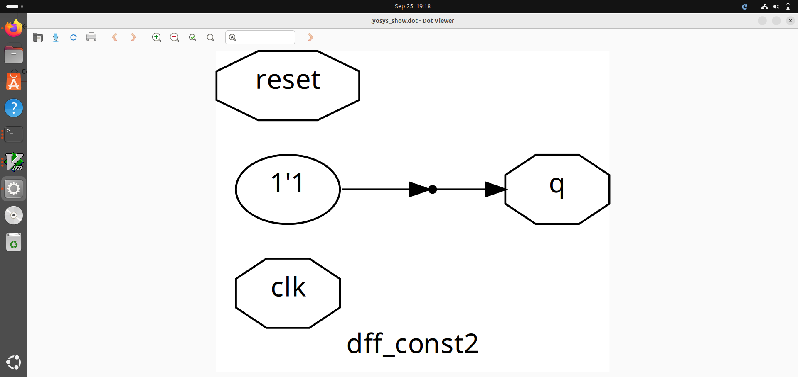
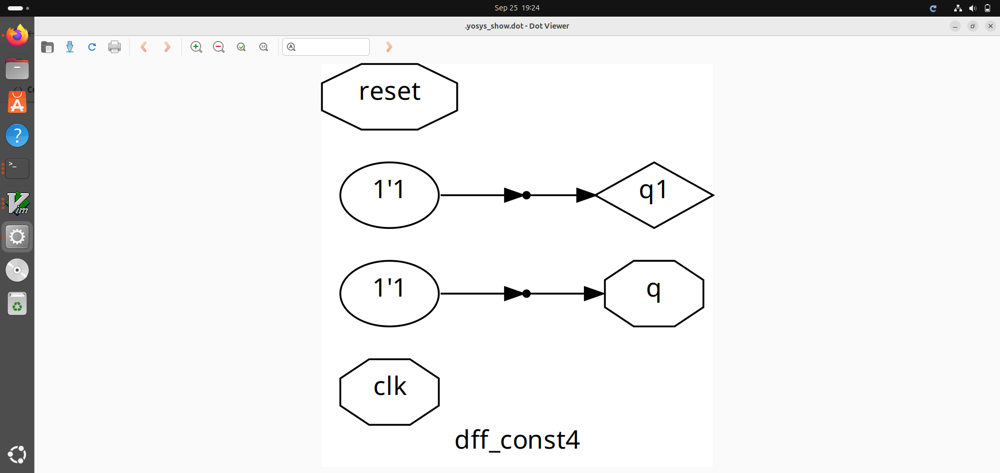
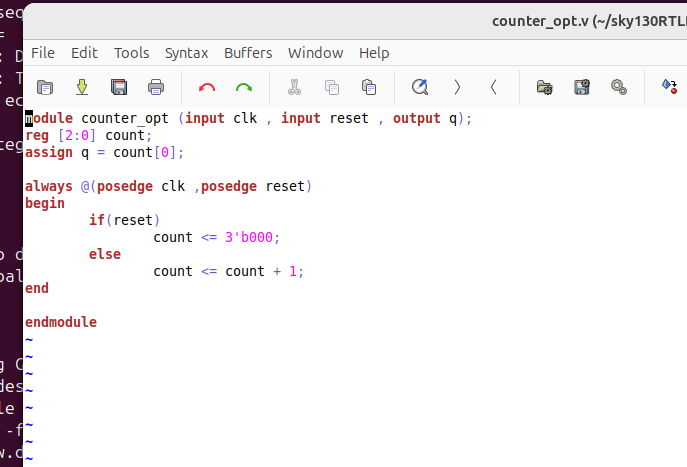

## 3. Day 3 - Combinational and Sequential Optimizations
**Logic Circuits**
Combinational circuits are defined as the time independent circuits which do not depends upon previous inputs to generate any output are termed as combinational circuits. Sequential circuits are those which are dependent on clock cycles and depends on present as well as past inputs to generate any output.

### 3.1. Introduction to Logic Optimizations

### Combinational Logic Optimization
**Why do we need Combinational Logic Optimizations?**

* Primarily to squeeze the logic to get the most optimized design.
    * An optimized design results in comprehensive Area and Power saving.

#### Types of Combinational Optimizations

* Constant Propagation 
	* Direct Optimization technique
* Boolean Logic Optimization.
	* Karnaugh map
	* Quine Mckluskey

#### CONSTANT PROPAGATION

In Constant propagation techniques, inputs that are no way related or affecting the changes in the output are ignored/optimized to simplify the combination logic thereby saving area and power usage by those input pins.
```
Y =((AB)+ C)'
If A = 0
Y =((0)+ C)' = C'
```
#### BOOLEAN LOGIC OPTIMIZATION

Boolean logic optimization is nothing simplifying a complex boolean expression into a simplified expression by utilizing the laws of boolean logic algebra.
```
assign y = a?(b?c:(c?a:0)):(!c)
```
above is simplified as
```
y = a'c' + a(bc + b'ca) 
y = a'c' + abc + ab'c 
y = a'c' + ac(b+b') 
y = a'c' + ac
y = a xor c
```
### Sequential Logic Optimization

#### Types of Sequential Optimizations

* Basic Technique
	* Sequential Constant Propagation
* Advanced Technique
	* State Optimization
	* Retiming
	* Sequential Logic cloning(Floorplan aware synthesis)
	
#### COMBINATIONAL LOGIC OPTIMIZATION  
```
//to view all optimization files
$ ls *opt_check*
//Invoke Yosys
$ yosys
//Read library 
$ read_liberty -lib ../lib/sky130_fd_sc_hd__tt_025C_1v80.lib
//Read Design
$ read_verilog opt_check.v
//Synthesize Design - this controls which module to synthesize
$ synth -top opt_check
//To perform constant propogation optimization
$ opt_clean -purge
//Generate Netlist
$ abc -liberty ../lib/sky130_fd_sc_hd__tt_025C_1v80.lib
//Realizing Graphical Version of Logic for single modules
$ show 
```

#### (i)opt_check.v
**_Expected logic from verilog file_**


>_value of y depends on a, y = ab._

**_Command for constant propogation method_**


**_Realization of the Logic_**


>_optimized graphical realization thus shows a 2-input AND gate being implemented._

### (ii) opt_check2.v
**_Expected logic from verilog file_**


>_value of y depends on a, y = a+b._

**_Realization of the Logic_**


>_optimized graphical realization thus shows 2-input OR gate being implemented. Although OR gate can be realized using NOR, it can lead to having stacked PMOS configuration which is not a design recommendation. So the OR gate is realized using NAND and NOT gates (which has stacked NMOS configuration)._

### (iii) opt_check3.v
**_Expected logic from verilog file_**


>_value of y depends on a, y = abc._

**_Realization of the Logic_**


>_optimized graphical realization thus shows 3-input AND gate being implemented._

### (iv) opt_check4.v
**_Expected logic from verilog file_**


>_The value of y depends on a, y = a'c + ac_

**_Realization of the Logic_**


>_optimized graphical realization thus shows A XNOR C gate being implemented._


#### SEQUENTIAL LOGIC OPTIMIZATION  
```
//To view all optimization files
$ ls *df*const*
//To open multiple files 
$ dff_const1.v -o dff_const2.v
//Performing Simulation
//Load the design in iVerilog by giving the verilog and testbench file names
$ iverilog dff_const1.v tb_dff_const1.v 
//To dump the VCD file
$ ./a.out
//To load the VCD file in GTKwaveform
$ gtkwave tb_dff_const1.vcd
//Performing Synthesis
//Invoke Yosys 
$ yosys
//Read library 
$ read_liberty -lib ../lib/sky130_fd_sc_hd_-tt_025C_1v80.lib
//Read Design
$ read_verilog dff_const1.v
//Synthesize Design - this controls which module to synthesize
$ synth -top dff_const1
//There will be a separate flop library under a standard library
//so we need to tell the design where to specifically pick up the DFF
//But here we point back to the same library and tool looks only for DFF instead of all cells
$ dfflibmap -liberty ../lib/sky130_fd_sc_hd_-tt_025C_1v80.lib
//Generate Netlist
$ abc -liberty ../my_lib/lib/sky130_fd_sc_hd_-tt_025C_1v80.lib
//Realizing Graphical Version of Logic for single modules
$ show 
```
#### (i)dff_const1.v

**_Expected logic from verilog file_**


**_GTK Wave_**


																		  
**_Realization of Logic_**


>_The optimized graphical realization thus shows the flop inferred. Also, the design code has active high reset and the standard cell library has active low reset - so, there is a presence of inverter for the reset._

#### (ii)dff_const2.v

**_Expected logic from verilog file_**


**_GTK Wave_**


**_Realization of Logic_**



#### (iii)dff_const3.v

**_Expected logic from verilog file_**


**_GTK Wave_**


											
**_Realization of Logic_**


#### (iv)dff_const4.v

**_Expected logic from verilog file_**


**_GTK Wave_**


**_Realization of Logic_**									



#### (v)dff_const5.v

**_Expected logic from verilog file_**


**_GTK Wave_**


#### SEQUENTIAL UNUSED OUTPUT OPTIMIZATION
```
//Steps Followed for each of the unused output optimization problems:
//opening the file
$ gvim counter_opt.v
//Invoke Yosys
$ yosys
//Read library 
$ read_liberty -lib ../lib/sky130_fd_sc_hd__tt_025C_1v80.lib
//Read Design
$ read_verilog opt_check.v
//Synthesize Design - this controls which module to synthesize
$ synth -top opt_check
//To perform constant propogation optimization
$ opt_clean -purge
//Generate Netlist
$ abc -liberty ../lib/sky130_fd_sc_hd_-tt_025C_1v80.lib
//Realizing Graphical Version of Logic for single modules
$ show 
```

#### (i) counter_opt.v

**_Expected logic from verilog file_**



>_If there is a reset, the counter is intialised to 0, else it is incremented - performing like an upcounter. Since it is a 3 bit signal, the counter rolls back after 7. However, the final output q is sensing only the count [0], so the bit is toggling in every clock cycle (000, 001, 010 ...111). The other two outputs are unused and does not create any output dependency. Hence, these unused outpus need not be present in the design._

**_Statistics showing only one flop inferred instead of 3 flops sinces it is a 3 bit counter_**


**_Realization of Logic_**


>_optimized graphical realization output Q (count0) being fed to NOT gate so as to perform the toggle function. The other outputs which has no dependency on the primary out is optimized off._

#### (ii) counter_opt2.v
```
//Steps Followed:
//Copying the code to a new file
$ cp counter_opt.v counter_opt2.v
$ gvim counter_opt2.v
//Changes made in the verilog code, i for insert mode: 
- assign q = [count2:0] == 3'b100;
```

**_Expected logic from verilog file_**


>_In this case, all three bits of the counter is used and hence 3 flops are expected in the optimized netlist._

**_Statistics showing all three flops inferred_**


----
