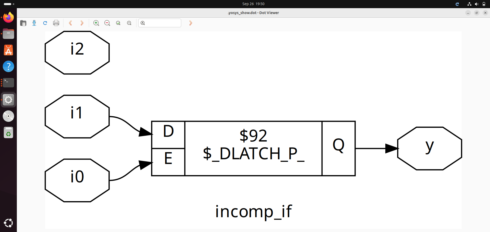
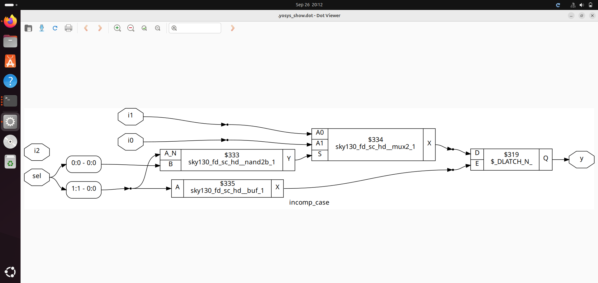

## 5. Day 5 - Optimization in synthesis

### 5.1 If Case constructs
The if statement is a conditional statement which uses boolean conditions to determine which blocks of verilog code to execute. If always translates into Multiplexer. It is used for priority Logic and are always used inside always block.The variable should be assigned as a register.

**_Syntax for IF Statement_**
```
if<cond>
begin
.....
.....
end
else
begin
.....
.....
end
```
**_Syntax for IF- ELSE-IF Statement_**
```
if<cond1>
begin
.....
 executes cb1
.....
end
else if<cond2>
begin
.....
  executes cb2
.....
end
else if<cond3>
begin
.....
  executes cb3
.....
end
else
begin
.....
  executes cb4
.....
end
```
----

**_Cautions with using IF Statements_**
Inferred latches can serve as a 'warning sign' that the logic design might not be implemented as intended. They represent a bad coding style, which happens because of incomplete if statements/crucial statements missing in the design. For ex: if a else statement is missing in the logic code, the hardware has not been informed on the decision, and hence it will latch and will tried retain the value. This type of design should be completely avoided unless intended to meet the design functionality (ex: Counter Design).

----

#### CASE Statements
The hardware implementation is a Multiplexer. Similar to IF Statements, Case statements are also used inside always block and the variable should be a register variable.

**Case Statements**
```
_reg y
always @ (*)
begin
	case(sel)
		2'b00:begin
		      ....
		      end
		2'b01:begin
		      ....
		      end
		      .
		      .
		      .
	endcase	
end
```
**Caveats in CASE Statements**

*Case statements are dangerous when there is an incomplete Case Statement Structure may lead to inferred latches. To avoid inferred latches, code Case with default conditions. 
```
reg y
always @ (*)
begin
	case(sel)
		2'b00:begin
		      ....
		      end
		2'b01:begin
		      ....
		      end
		      .
		      .
	default:begin
         ....
		       end
	endcase	
end
```
*Partial Assignments in Case statements - not specifying the values. This will also create inferred latches. To avoid inferred latches, assign all the inputs in all the segments of the case statement.

### 5.2 INCOMPLETE IF STATEMENTS

#### * (Case 1) incomplete if statements

**_GTK Wave_**


>_Else case is missing so there will be a D latch._

**_Synthesis Statistics_**																		  


**_Realization of Logic_**


>_synthesized design has a D Latch inferred due to incomplete if structure (missing else statement)._

#### * (Case2) incomplete if statements

**_Verilog File_**


**_GTK Wave_**


>_When i0 is high, the output follows i1. When i0 is low, the output latches to a constant value (when both i0 and i2 are 0). Presence of inferred latches due to incomplete if structure._

**_Synthesis Statistics_**


**_Realization of Logic_**


### 5.2 INCOMPLETE CASE STATEMENTS

#### CASE 1: incomplete case statements
**_Verilog File_**


**_GTK Wave_**


>_When select signal is 00, the output follows i0 and is i1 when the select value is 01. Since the output is undefined for 10 and 11 values, the ouput latches to the previously available value._

**_Synthesis Statistics_**


**_Realization of Logic_**



>_The synthesized design has a D Latch inferred due to incomplete case structure (missing output definition for 2 of the select statements)._

#### CASE 2: incomplete case statements with default

**_Verilog File_**


**_Synthesis Statistics_**


**_GTK Wave_**


>_When select signal is 00, the output follows i0 and is i1 when the select value is 01. Since the output is undefined for 10 and 11 values, the presence of default sets the output to i2 when the select line is 10 or 11. The ouput will not latch and be a proper combinational circuit._
**_Realization of Logic_**


#### CASE 3: partial case statement
**_Verilog File_**


**_Synthesis Statistics_**


**_Realization of Logic_**


#### CASE 4: Overlapping case

**_GTK Wave_**


**_Synthesis Output_**


**_GLS_**


### 5.3 STATEMENTS USING FOR

_Understanding the Usage of For and Generate Statements:_

|FOR STATEMENTS|GENERATE STATEMENTS|
|:---:|:---:|
|These statements are used inside the always block|These statements are used outsde the always block|
|Used for evaluating expressions|Used for instantiating/replicating Hardwares|

#### CASE 1: using generate if statement

**_Verilog File_**


**_GTK Wave_**


**_Synthesis Statistics_**


**_GLS_**


#### CASE 2: demux using case statement.v

**_Verilog File_**


**_GTK Wave_**


#### CASE 3: demux using generate if statement.v 

**_Verilog File_**


**_GTK Wave_**


**_GLS Output_**


### 5.3 STATEMENTS USING GENERATE

**_Experiment on Ripple Carry Adder_**
>_Instantiating the full adder in a loop to replicate the hardware_
**_Verilog File_**


**_GTK Wave_**


**_Realization of Logic - rca_**


**_GLS Output_**


