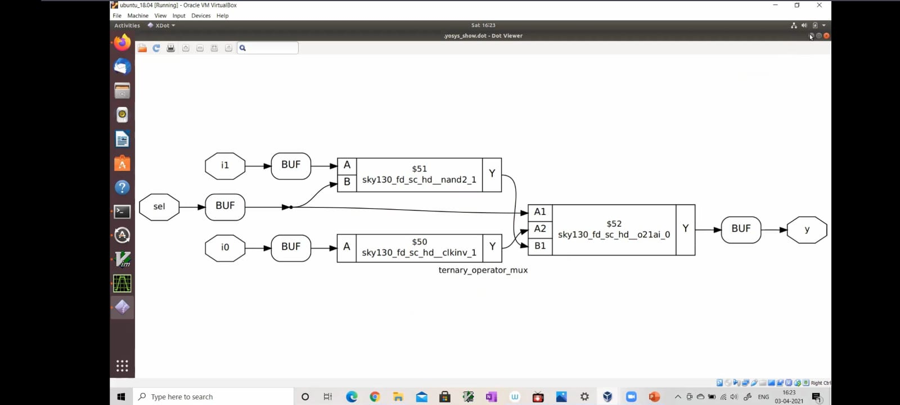
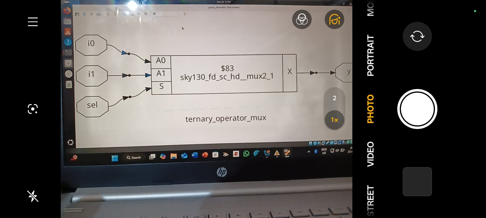
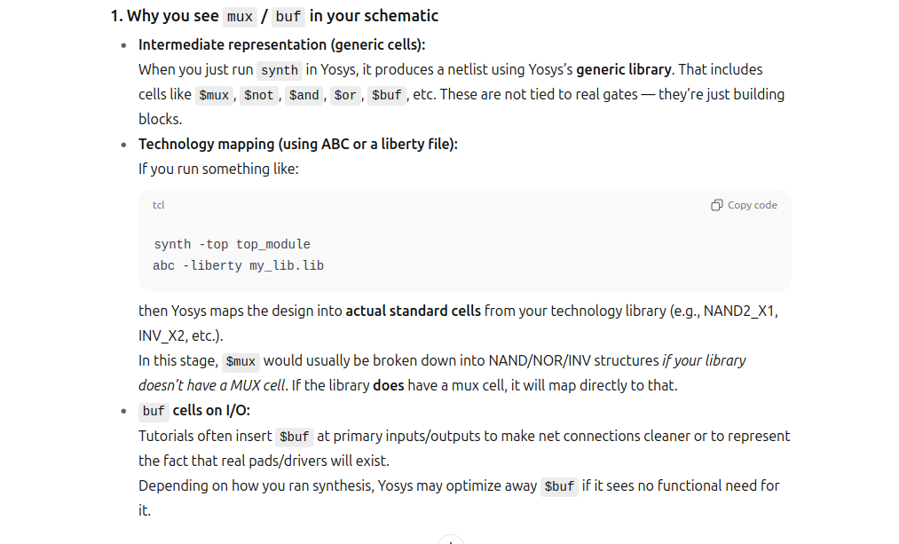
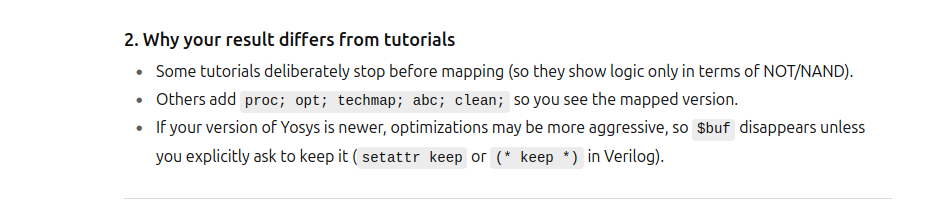

# _ISSUE_

I am not getting the blocks like buf in yosys netlist schematic. Floowed exactly the same as tutorial but nit getting those blocks but the output is still correct. Also for OR gate, in tutorial it has taken two inverters to nand gare to get OR but I get the OR gate directly. Tried many ways also debugged with GPT but maybe its due to sme standard settings or configuration of latest version of YOSYS.

---

## _Solution that chatgpt recommended_

---

